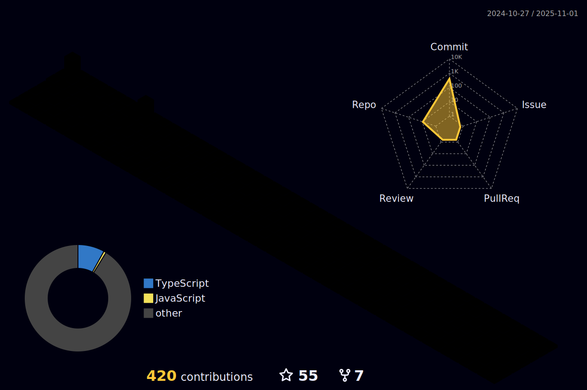

Oh hi, nice to meet you ✨
-

Let me introduce myself!

👩‍💻 My name is Hafizur Rahman

💻 I've been working as a Frontend Engineer.

📈 Having started my journey in 2021 as a Frontend developer, In my career, I explored a wide range of technologies for frontend and backend development, but my specialty is frontend development.

🧠 I'm a fan of looking for solutions that will make this or that process easier, even if it means I need to create it myself (tools, frameworks, scripts, etc).

⚡ An investigator for the upcoming casual future, curious to know how Starlink works and what is the following invention for the human progressive procedure stage.

 Technologies Badges 

    

  
  
 
  
  
  
  
  
   
  
  
   
  
   
  
  
   
  
  
   
  
  
  
  

</td><td >

